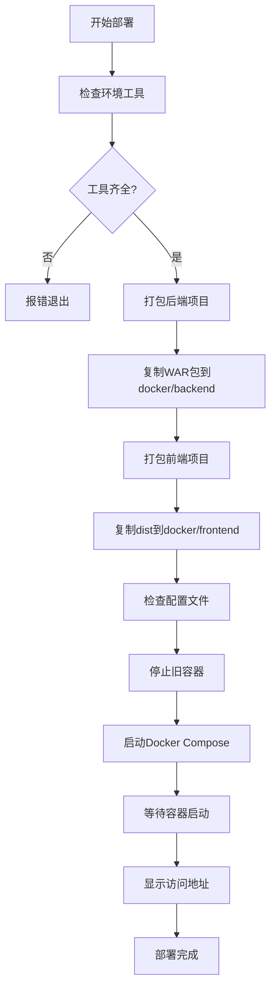
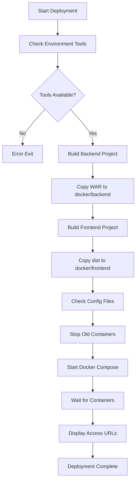

<div align="right" style="margin-bottom: 20px;">
  <strong>Language / 语言:</strong>
  <a href="#chinese-version">中文</a> | 
  <a href="#english-version">English</a>
</div>

---

<a name="chinese-version"></a>
## 🇨🇳 中文版 / Chinese Version

# 碳排放管理系统

一个UI精简、优美且前后端分离的碳排放管理系统，可视化管理碳排放数据。
<br>麻雀虽小，五脏俱全。系统集成了JWT无状态认证、RBAC角色权限校验、数据可视化、文件流导出、线程池异步处理、缓存限流、AOP自定义切面注解、设计模式等最佳实践。

## 📋 目录

- [技术栈](#技术栈)
- [系统架构](#系统架构)
- [业务亮点](#业务亮点)
- [部署环境](#部署环境)
- [一键部署](#一键部署)
- [项目结构](#项目结构)

## 🛠 技术栈

### 后端技术栈

| 技术 | 版本 | 说明 |
|------|------|------|
| Java | 1.8 | 开发语言 |
| Spring Boot | 2.6.4 | 核心框架 |
| Spring Security | 2.6.4 | 安全框架 |
| MyBatis Plus | 3.5.1 | ORM框架 |
| MySQL | 8.0 | 关系型数据库 |
| Redis | 7 | 缓存和限流 |
| JWT | 0.9.1 | 无状态认证 |
| Apache POI | 5.1.0 | Office文档处理 |
| Apache PDFBox | 2.0.28 | PDF生成 |
| docx4j | 8.3.15 | Word文档处理 |
| EasyExcel | 2.2.10 | Excel处理 |
| Hutool | 5.8.12 | Java工具类库 |
| FastJSON | 1.2.80 | JSON处理 |
| JFreeChart | 1.5.3 | 图表生成 |
| ECharts Java | 3.0.0.6 | ECharts封装 |

### 前端技术栈

| 技术 | 版本 | 说明 |
|------|------|------|
| Vue | 2.5.2 | 前端框架 |
| Element UI | 2.15.6 | UI组件库 |
| ECharts | 5.3.1 | 数据可视化 |
| Axios | 0.26.1 | HTTP客户端 |
| Vue Router | 3.0.1 | 路由管理 |
| Webpack | 3.6.0 | 构建工具 |
| Less | 4.1.2 | CSS预处理器 |

### 部署技术栈

| 技术 | 版本 | 说明 |
|------|------|------|
| Docker | Latest | 容器化 |
| Docker Compose | Latest | 容器编排 |
| Nginx | 1.20-alpine | Web服务器 |
| Tomcat | 9.0-jdk8 | 应用服务器 |

## 🏗 系统架构

### 整体架构图

```
┌─────────────────────────────────────────────────────────────┐
│                        前端层 (Vue)                          │
│  ┌──────────┐  ┌──────────┐  ┌──────────┐  ┌──────────┐   │
│  │  登录页  │  │  审计页  │  │  导出页  │  │  管理页  │   │
│  └──────────┘  └──────────┘  └──────────┘  └──────────┘   │
└──────────────────────┬──────────────────────────────────────┘
                       │ HTTP/HTTPS
                       │ JWT Token
┌──────────────────────▼──────────────────────────────────────┐
│                    Nginx (反向代理)                         │
└──────────────────────┬──────────────────────────────────────┘
                       │
┌──────────────────────▼──────────────────────────────────────┐
│                   后端层 (Spring Boot)                       │
│  ┌──────────────────────────────────────────────────────┐  │
│  │            Spring Security + JWT Filter              │  │
│  │  ┌──────────────┐  ┌──────────────┐                 │  │
│  │  │ 认证过滤器   │  │ 权限校验器   │                 │  │
│  │  └──────────────┘  └──────────────┘                 │  │
│  └──────────────────────────────────────────────────────┘  │
│  ┌──────────────────────────────────────────────────────┐  │
│  │              Controller 层 (RESTful API)              │  │
│  └──────────────────────────────────────────────────────┘  │
│  ┌──────────────────────────────────────────────────────┐  │
│  │              Service 层 (业务逻辑)                    │  │
│  │  ┌──────────────┐  ┌──────────────┐                 │  │
│  │  │ 异步导出服务 │  │ 策略模式工厂 │                 │  │
│  │  └──────────────┘  └──────────────┘                 │  │
│  └──────────────────────────────────────────────────────┘  │
│  ┌──────────────────────────────────────────────────────┐  │
│  │              AOP 切面层                               │  │
│  │  ┌──────────────┐  ┌──────────────┐                 │  │
│  │  │ 限流切面     │  │ 缓存切面     │                 │  │
│  │  └──────────────┘  └──────────────┘                 │  │
│  └──────────────────────────────────────────────────────┘  │
│  ┌──────────────────────────────────────────────────────┐  │
│  │              Mapper 层 (MyBatis Plus)                 │  │
│  └──────────────────────────────────────────────────────┘  │
└──────────────────────┬──────────────────────────────────────┘
                       │
        ┌──────────────┼──────────────┐
        │              │              │
┌───────▼──────┐ ┌─────▼─────┐ ┌─────▼─────┐
│   MySQL 8.0  │ │  Redis 7  │ │  文件系统  │
│   (数据存储)  │ │ (缓存限流) │ │ (文件导出) │
└──────────────┘ └───────────┘ └───────────┘
```

## ✨ 业务亮点

### 1. JWT无状态认证

- **无状态设计**：服务端不存储Session，所有认证信息存储在JWT Token中
- **双Token机制**：Access Token（30分钟）+ Refresh Token（1天）
- **自动刷新**：前端自动检测Token过期并刷新
- **游客模式**：支持未登录用户访问公开接口

**实现位置**：
- `JwtTokenProvider`：Token生成和验证
- `JwtAuthenticationFilter`：请求拦截和认证
- `SecurityConfig`：Spring Security配置

### 2. RBAC角色权限校验

- **多角色支持**：超级管理员、管理员、普通用户、游客
- **权限树形结构**：支持菜单权限和API权限的树形管理
- **动态权限加载**：根据用户角色动态加载权限
- **权限缓存**：游客权限缓存，减少数据库查询

**实现位置**：
- `UserDetailsServiceImpl`：用户权限加载
- `PermissionMapper`：权限数据查询
- `SecurityPermissionServiceImpl`：权限校验服务

### 3. 数据可视化

- **ECharts集成**：丰富的图表类型（折线图、柱状图、饼图、桑基图等）
- **实时数据展示**：支持按年份、月份、地点筛选
- **多维度分析**：碳排放量、电耗、单位面积排放等指标
- **响应式设计**：适配不同屏幕尺寸

**实现位置**：
- `TanAnalyse.vue`：数据分析页面
- `TanContrast.vue`：数据对比页面
- `TanMonitor.vue`：数据监控页面

### 4. 文件流导出（Word/PDF/Excel）

- **多格式支持**：Word (.docx)、PDF、Excel (.xlsx)
- **模板化导出**：基于Word模板生成报告
- **中文支持**：完美支持中文字体和格式
- **大文件处理**：支持大数据量导出

**实现位置**：
- `XWPFUtils`：Word文档处理工具
- `WordExportStrategy`：Word导出策略
- `PdfExportStrategy`：PDF导出策略
- `ExcelExportStrategy`：Excel导出策略

### 5. 线程池异步处理 + 轮询

- **异步任务处理**：导出任务异步执行，不阻塞主线程
- **任务状态跟踪**：Redis存储任务状态，支持查询
- **前端轮询机制**：前端每2秒轮询任务状态
- **文件缓存**：相同参数的导出任务复用缓存文件

**实现位置**：
- `AsyncExportService`：异步导出服务
- `ExportThreadPoolConfig`：线程池配置
- `TanExport.vue`：前端轮询逻辑

### 6. Redis缓存和限流

- **接口限流**：基于AOP的注解式限流，支持IP限流和接口限流
- **数据缓存**：热点数据缓存，减少数据库压力
- **文件缓存**：导出文件缓存，避免重复生成
- **任务状态存储**：异步任务状态存储在Redis

**实现位置**：
- `RateLimitAspect`：限流切面
- `CacheAspect`：缓存切面
- `RedisService`：Redis工具类

### 7. AOP自定义切面注解

- **限流注解**：`@RateLimit`，支持IP和接口双重限流
- **缓存注解**：`@RedisCache`，自动缓存方法返回值
- **切面复用**：统一的切面逻辑，减少重复代码

**实现位置**：
- `annotation/RateLimit.java`：限流注解
- `annotation/RedisCache.java`：缓存注解
- `aspect/RateLimitAspect.java`：限流切面
- `aspect/CacheAspect.java`：缓存切面

### 8. 设计模式应用

- **策略模式**：导出策略（Word/PDF/Excel）使用策略模式
- **工厂模式**：`ExportStrategyFactory`创建不同的导出策略
- **单例模式**：工具类使用单例模式
- **模板方法模式**：导出流程使用模板方法

**实现位置**：
- `strategy/ExportStrategy.java`：策略接口
- `strategy/ExportStrategyFactory.java`：策略工厂

## 🚀 部署环境

### 环境要求

| 软件 | 版本要求 | 说明 |
|------|---------|------|
| JDK | 1.8+ | Java开发环境 |
| Maven | 3.6+ | 项目构建工具 |
| Node.js | 6.0+ | 前端构建环境 |
| npm | 3.0+ | Node包管理器 |
| Docker | Latest | 容器运行时 |
| Docker Compose | Latest | 容器编排工具 |

### 数据库配置

- **数据库名**：`sys_carbon`
- **字符集**：`utf8mb4`
- **默认用户**：`root`
- **默认密码**：`123456`

> ⚠️ **安全提示**：生产环境请修改默认密码和端口配置

## 📦 一键部署

### 快速开始

一键部署脚本，只需执行以下命令：

```bash
# 进入docker目录
cd docker

# 赋予执行权限（Linux/Mac）
chmod +x deploy.sh

# 执行一键部署脚本
./deploy.sh
```

### 部署脚本功能

`deploy.sh`脚本会自动完成以下操作：

1. **环境检查**：检查Maven、npm、Docker等必要工具
2. **后端打包**：使用Maven打包后端项目，生成WAR包
3. **前端打包**：使用npm构建前端项目，生成dist目录
4. **文件复制**：将打包产物复制到docker目录
5. **容器启动**：使用Docker Compose启动所有服务

### 部署流程



### 访问地址

部署成功后，可以通过以下地址访问：

- **前端地址**：http://localhost:4432
- **后端API**：http://localhost:12306/api
- **数据库**：localhost:4436
- **Redis**：localhost:4439

### 停止服务

```bash
cd docker
docker-compose down
```

### 重启服务

```bash
cd docker
docker-compose restart
```

### 清理数据（谨慎操作）

```bash
cd docker
# 停止并删除容器和数据卷
docker-compose down -v
```

## 📁 项目结构

```
carbon_emission_system/
├── carbon-emission-backend/          # 后端项目
│   ├── src/
│   │   ├── main/
│   │   │   ├── java/com/bjfu/carbon/
│   │   │   │   ├── annotation/      # 自定义注解（限流、缓存）
│   │   │   │   ├── aspect/          # AOP切面
│   │   │   │   ├── config/          # 配置类
│   │   │   │   ├── controller/      # 控制器层
│   │   │   │   ├── domain/          # 实体类
│   │   │   │   ├── mapper/          # MyBatis Mapper
│   │   │   │   ├── security/        # 安全相关（JWT、权限）
│   │   │   │   ├── service/         # 服务层
│   │   │   │   ├── strategy/        # 策略模式（导出策略）
│   │   │   │   ├── utils/           # 工具类
│   │   │   │   └── vo/              # 视图对象
│   │   │   └── resources/
│   │   │       ├── mapper/          # MyBatis XML映射文件
│   │   │       ├── sql/             # SQL脚本
│   │   │       └── application.yml  # 配置文件
│   │   └── test/                     # 测试代码
│   └── pom.xml                       # Maven配置
│
├── carbon-emission-front/            # 前端项目
│   ├── src/
│   │   ├── api/                     # API接口定义
│   │   ├── assets/                  # 静态资源
│   │   ├── components/              # Vue组件
│   │   ├── page/                    # 页面组件
│   │   │   ├── admin/               # 管理员页面
│   │   │   └── tan/                 # 碳排放相关页面
│   │   ├── router/                  # 路由配置
│   │   └── utils/                   # 工具函数
│   ├── build/                       # Webpack构建配置
│   ├── config/                      # 项目配置
│   └── package.json                 # npm配置
│
└── docker/                          # Docker部署配置
    ├── backend/                     # 后端部署文件
    │   ├── fonts/                   # 字体文件
    │   └── sys_carbon-0.0.1-SNAPSHOT.war
    ├── frontend/                    # 前端部署文件
    │   ├── dist/                    # 前端构建产物
    │   └── default.conf             # Nginx配置
    ├── docker-compose.yml           # Docker Compose配置
    └── deploy.sh                    # 一键部署脚本
```

## 📄 许可证

本项目采用 [LICENSE](LICENSE) 许可证。

## 🙏 后话

项目很轻量，主要是提供平台，欢迎提交 Issue 和 Pull Request 以此为基，添加你觉得能有价值的功能点，展示技术实力，一起成为本项目的开源贡献者。

---

<a name="english-version"></a>
## 🇬🇧 English Version / 英文版

# Carbon Emission Management System

A lightweight, elegant, and frontend-backend separated carbon emission management system for visualizing and managing carbon emission data.
<br>Small but complete. The system integrates best practices including JWT stateless authentication, RBAC role-based access control, data visualization, file stream export, thread pool asynchronous processing, caching and rate limiting, AOP custom aspect annotations, and design patterns.

## 📋 Table of Contents

- [Tech Stack](#tech-stack)
- [System Architecture](#system-architecture)
- [Business Highlights](#business-highlights)
- [Deployment Environment](#deployment-environment)
- [One-Click Deployment](#one-click-deployment)
- [Project Structure](#project-structure)

## 🛠 Tech Stack

### Backend Tech Stack

| Technology | Version | Description |
|------------|---------|-------------|
| Java | 1.8 | Programming Language |
| Spring Boot | 2.6.4 | Core Framework |
| Spring Security | 2.6.4 | Security Framework |
| MyBatis Plus | 3.5.1 | ORM Framework |
| MySQL | 8.0 | Relational Database |
| Redis | 7 | Caching and Rate Limiting |
| JWT | 0.9.1 | Stateless Authentication |
| Apache POI | 5.1.0 | Office Document Processing |
| Apache PDFBox | 2.0.28 | PDF Generation |
| docx4j | 8.3.15 | Word Document Processing |
| EasyExcel | 2.2.10 | Excel Processing |
| Hutool | 5.8.12 | Java Utility Library |
| FastJSON | 1.2.80 | JSON Processing |
| JFreeChart | 1.5.3 | Chart Generation |
| ECharts Java | 3.0.0.6 | ECharts Wrapper |

### Frontend Tech Stack

| Technology | Version | Description |
|------------|---------|-------------|
| Vue | 2.5.2 | Frontend Framework |
| Element UI | 2.15.6 | UI Component Library |
| ECharts | 5.3.1 | Data Visualization |
| Axios | 0.26.1 | HTTP Client |
| Vue Router | 3.0.1 | Route Management |
| Webpack | 3.6.0 | Build Tool |
| Less | 4.1.2 | CSS Preprocessor |

### Deployment Tech Stack

| Technology | Version | Description |
|------------|---------|-------------|
| Docker | Latest | Containerization |
| Docker Compose | Latest | Container Orchestration |
| Nginx | 1.20-alpine | Web Server |
| Tomcat | 9.0-jdk8 | Application Server |

## 🏗 System Architecture

### Overall Architecture Diagram

```
┌─────────────────────────────────────────────────────────────┐
│                    Frontend Layer (Vue)                     │
│  ┌──────────┐  ┌──────────┐  ┌──────────┐  ┌──────────┐   │
│  │  Login   │  │  Audit   │  │  Export  │  │  Admin   │   │
│  └──────────┘  └──────────┘  └──────────┘  └──────────┘   │
└──────────────────────┬──────────────────────────────────────┘
                       │ HTTP/HTTPS
                       │ JWT Token
┌──────────────────────▼──────────────────────────────────────┐
│                  Nginx (Reverse Proxy)                      │
└──────────────────────┬──────────────────────────────────────┘
                       │
┌──────────────────────▼──────────────────────────────────────┐
│                 Backend Layer (Spring Boot)                  │
│  ┌──────────────────────────────────────────────────────┐  │
│  │            Spring Security + JWT Filter              │  │
│  │  ┌──────────────┐  ┌──────────────┐                 │  │
│  │  │ Auth Filter   │  │ Permission   │                 │  │
│  │  └──────────────┘  └──────────────┘                 │  │
│  └──────────────────────────────────────────────────────┘  │
│  ┌──────────────────────────────────────────────────────┐  │
│  │              Controller Layer (RESTful API)            │  │
│  └──────────────────────────────────────────────────────┘  │
│  ┌──────────────────────────────────────────────────────┐  │
│  │              Service Layer (Business Logic)           │  │
│  │  ┌──────────────┐  ┌──────────────┐                 │  │
│  │  │ Async Export │  │ Strategy      │                 │  │
│  │  │ Service      │  │ Factory      │                 │  │
│  │  └──────────────┘  └──────────────┘                 │  │
│  └──────────────────────────────────────────────────────┘  │
│  ┌──────────────────────────────────────────────────────┐  │
│  │              AOP Aspect Layer                         │  │
│  │  ┌──────────────┐  ┌──────────────┐                 │  │
│  │  │ Rate Limit   │  │ Cache        │                 │  │
│  │  │ Aspect       │  │ Aspect       │                 │  │
│  │  └──────────────┘  └──────────────┘                 │  │
│  └──────────────────────────────────────────────────────┘  │
│  ┌──────────────────────────────────────────────────────┐  │
│  │              Mapper Layer (MyBatis Plus)              │  │
│  └──────────────────────────────────────────────────────┘  │
└──────────────────────┬──────────────────────────────────────┘
                       │
        ┌──────────────┼──────────────┐
        │              │              │
┌───────▼──────┐ ┌─────▼─────┐ ┌─────▼─────┐
│  MySQL 8.0   │ │  Redis 7  │ │ File      │
│  (Database)  │ │ (Cache &  │ │ System    │
│              │ │  Rate     │ │ (Export)  │
│              │ │  Limit)   │ │           │
└──────────────┘ └───────────┘ └───────────┘
```

## ✨ Business Highlights

### 1. JWT Stateless Authentication

- **Stateless Design**: Server does not store sessions, all authentication information is stored in JWT tokens
- **Dual Token Mechanism**: Access Token (30 minutes) + Refresh Token (1 day)
- **Auto Refresh**: Frontend automatically detects token expiration and refreshes
- **Guest Mode**: Supports unauthenticated users accessing public interfaces

**Implementation Locations**:
- `JwtTokenProvider`: Token generation and validation
- `JwtAuthenticationFilter`: Request interception and authentication
- `SecurityConfig`: Spring Security configuration

### 2. RBAC Role-Based Access Control

- **Multi-Role Support**: Super Admin, Admin, Regular User, Guest
- **Permission Tree Structure**: Supports tree management of menu permissions and API permissions
- **Dynamic Permission Loading**: Loads permissions dynamically based on user roles
- **Permission Caching**: Guest permission caching to reduce database queries

**Implementation Locations**:
- `UserDetailsServiceImpl`: User permission loading
- `PermissionMapper`: Permission data queries
- `SecurityPermissionServiceImpl`: Permission validation service

### 3. Data Visualization

- **ECharts Integration**: Rich chart types (line charts, bar charts, pie charts, Sankey diagrams, etc.)
- **Real-time Data Display**: Supports filtering by year, month, and location
- **Multi-dimensional Analysis**: Carbon emission, power consumption, emission per unit area, and other indicators
- **Responsive Design**: Adapts to different screen sizes

**Implementation Locations**:
- `TanAnalyse.vue`: Data analysis page
- `TanContrast.vue`: Data comparison page
- `TanMonitor.vue`: Data monitoring page

### 4. File Stream Export (Word/PDF/Excel)

- **Multi-format Support**: Word (.docx), PDF, Excel (.xlsx)
- **Template-based Export**: Generates reports based on Word templates
- **Chinese Support**: Perfect support for Chinese fonts and formatting
- **Large File Handling**: Supports large data volume exports

**Implementation Locations**:
- `XWPFUtils`: Word document processing utility
- `WordExportStrategy`: Word export strategy
- `PdfExportStrategy`: PDF export strategy
- `ExcelExportStrategy`: Excel export strategy

### 5. Thread Pool Asynchronous Processing + Polling

- **Asynchronous Task Processing**: Export tasks execute asynchronously without blocking the main thread
- **Task Status Tracking**: Redis stores task status for querying
- **Frontend Polling Mechanism**: Frontend polls task status every 2 seconds
- **File Caching**: Export tasks with the same parameters reuse cached files

**Implementation Locations**:
- `AsyncExportService`: Asynchronous export service
- `ExportThreadPoolConfig`: Thread pool configuration
- `TanExport.vue`: Frontend polling logic

### 6. Redis Caching and Rate Limiting

- **Interface Rate Limiting**: Annotation-based rate limiting using AOP, supports IP and interface rate limiting
- **Data Caching**: Hotspot data caching to reduce database pressure
- **File Caching**: Export file caching to avoid duplicate generation
- **Task Status Storage**: Asynchronous task status stored in Redis

**Implementation Locations**:
- `RateLimitAspect`: Rate limiting aspect
- `CacheAspect`: Caching aspect
- `RedisService`: Redis utility class

### 7. AOP Custom Aspect Annotations

- **Rate Limiting Annotation**: `@RateLimit`, supports dual rate limiting for IP and interface
- **Cache Annotation**: `@RedisCache`, automatically caches method return values
- **Aspect Reuse**: Unified aspect logic to reduce duplicate code

**Implementation Locations**:
- `annotation/RateLimit.java`: Rate limiting annotation
- `annotation/RedisCache.java`: Cache annotation
- `aspect/RateLimitAspect.java`: Rate limiting aspect
- `aspect/CacheAspect.java`: Cache aspect

### 8. Design Pattern Applications

- **Strategy Pattern**: Export strategies (Word/PDF/Excel) use the strategy pattern
- **Factory Pattern**: `ExportStrategyFactory` creates different export strategies
- **Singleton Pattern**: Utility classes use singleton pattern
- **Template Method Pattern**: Export process uses template method

**Implementation Locations**:
- `strategy/ExportStrategy.java`: Strategy interface
- `strategy/ExportStrategyFactory.java`: Strategy factory

## 🚀 Deployment Environment

### Environment Requirements

| Software | Version Requirement | Description |
|----------|---------------------|-------------|
| JDK | 1.8+ | Java Development Environment |
| Maven | 3.6+ | Project Build Tool |
| Node.js | 6.0+ | Frontend Build Environment |
| npm | 3.0+ | Node Package Manager |
| Docker | Latest | Container Runtime |
| Docker Compose | Latest | Container Orchestration Tool |

### Database Configuration

- **Database Name**: `sys_carbon`
- **Character Set**: `utf8mb4`
- **Default User**: `root`
- **Default Password**: `123456`

> ⚠️ **Security Notice**: Please modify default passwords and port configurations in production environments

## 📦 One-Click Deployment

### Quick Start

One-click deployment script, just execute the following commands:

```bash
# Navigate to docker directory
cd docker

# Grant execute permission (Linux/Mac)
chmod +x deploy.sh

# Execute one-click deployment script
./deploy.sh
```

### Deployment Script Functions

The `deploy.sh` script automatically completes the following operations:

1. **Environment Check**: Checks necessary tools like Maven, npm, Docker
2. **Backend Build**: Uses Maven to build the backend project and generate WAR package
3. **Frontend Build**: Uses npm to build the frontend project and generate dist directory
4. **File Copy**: Copies build artifacts to docker directory
5. **Container Startup**: Uses Docker Compose to start all services

### Deployment Flow



### Access Addresses

After successful deployment, access via the following addresses:

- **Frontend**: http://localhost:4432
- **Backend API**: http://localhost:12306/api
- **Database**: localhost:4436
- **Redis**: localhost:4439

### Stop Services

```bash
cd docker
docker-compose down
```

### Restart Services

```bash
cd docker
docker-compose restart
```

### Clean Data (Use with Caution)

```bash
cd docker
# Stop and remove containers and volumes
docker-compose down -v
```

## 📁 Project Structure

```
carbon_emission_system/
├── carbon-emission-backend/          # Backend Project
│   ├── src/
│   │   ├── main/
│   │   │   ├── java/com/bjfu/carbon/
│   │   │   │   ├── annotation/      # Custom Annotations (Rate Limit, Cache)
│   │   │   │   ├── aspect/          # AOP Aspects
│   │   │   │   ├── config/          # Configuration Classes
│   │   │   │   ├── controller/      # Controller Layer
│   │   │   │   ├── domain/          # Entity Classes
│   │   │   │   ├── mapper/          # MyBatis Mapper
│   │   │   │   ├── security/        # Security Related (JWT, Permissions)
│   │   │   │   ├── service/         # Service Layer
│   │   │   │   ├── strategy/        # Strategy Pattern (Export Strategies)
│   │   │   │   ├── utils/           # Utility Classes
│   │   │   │   └── vo/              # View Objects
│   │   │   └── resources/
│   │   │       ├── mapper/          # MyBatis XML Mapping Files
│   │   │       ├── sql/             # SQL Scripts
│   │   │       └── application.yml  # Configuration File
│   │   └── test/                     # Test Code
│   └── pom.xml                       # Maven Configuration
│
├── carbon-emission-front/            # Frontend Project
│   ├── src/
│   │   ├── api/                     # API Interface Definitions
│   │   ├── assets/                  # Static Resources
│   │   ├── components/              # Vue Components
│   │   ├── page/                    # Page Components
│   │   │   ├── admin/               # Admin Pages
│   │   │   └── tan/                 # Carbon Emission Related Pages
│   │   ├── router/                  # Route Configuration
│   │   └── utils/                   # Utility Functions
│   ├── build/                       # Webpack Build Configuration
│   ├── config/                      # Project Configuration
│   └── package.json                 # npm Configuration
│
└── docker/                          # Docker Deployment Configuration
    ├── backend/                     # Backend Deployment Files
    │   ├── fonts/                   # Font Files
    │   └── sys_carbon-0.0.1-SNAPSHOT.war
    ├── frontend/                    # Frontend Deployment Files
    │   ├── dist/                    # Frontend Build Artifacts
    │   └── default.conf             # Nginx Configuration
    ├── docker-compose.yml           # Docker Compose Configuration
    └── deploy.sh                    # One-Click Deployment Script
```

## 📄 License

This project is licensed under the [LICENSE](LICENSE) license.

## 🙏 Closing Words

The project is lightweight and mainly provides a platform. We welcome Issue submissions and Pull Requests. Based on this foundation, add features you think would be valuable, showcase your technical skills, and become an open source contributor to this project together.
